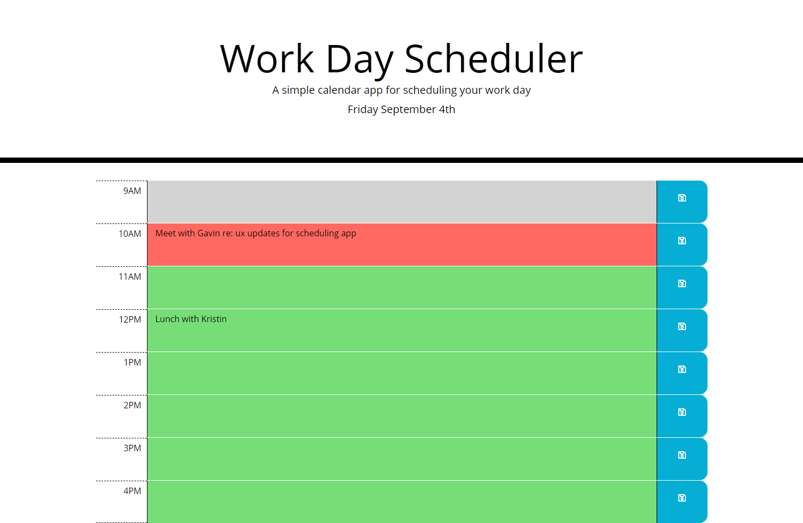

# Work Day Scheduler

## Page Description
This page provides a simple daily planner to create a schedule. When the user opens the application page, the current day is displayed at the top of the calendar. Time blocks are shown for the hours of the day, color coded the past, the current hour, and the remainder of the day. The user can click on a time block to enter an event. Pressing the save button saves the event to local storage. Events are loaded from local storage when the page is opened or refreshed.

## Page Link
This page is hosted at https://kpehl.github.io/work-day-scheduler/

## Tools Used
* JavaScript
* jQuery/jQueryUI
* Bootstrap
* moment
* HTML
* CSS

## Screenshot

